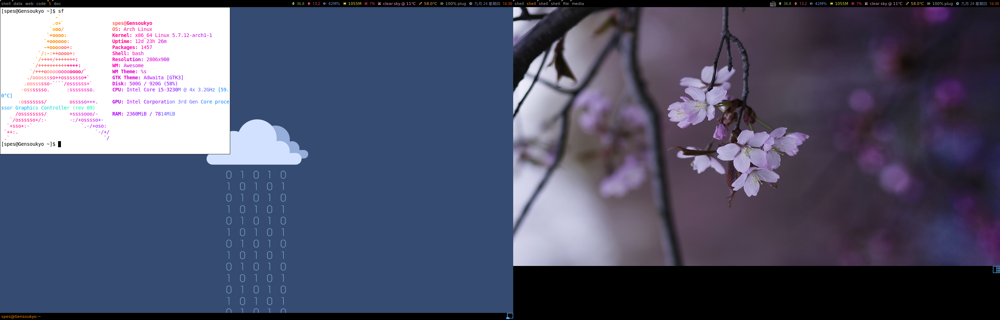

# awesome-rua

a awesome wm theme with some custom settings.

based on [copycats/multicolor](https://github.com/lcpz/awesome-copycats/tree/master/themes/multicolor).

random wallpaper switch based on [arch wiki]([https://wiki.archlinux.org/index.php/Awesome_(%E7%AE%80%E4%BD%93%E4%B8%AD%E6%96%87)#%E8%AE%BE%E7%BD%AE%E5%A2%99%E7%BA%B8](https://wiki.archlinux.org/index.php/Awesome_(简体中文)#设置墙纸). 


and my desktop with two monitors:




```shell
$ xrandr --listmonitors
Monitors: 2
 0: +*LVDS1 1366/340x768/190+1440+0  LVDS1
 1: +VGA1 1440/420x900/260+0+0  VGA1
```

